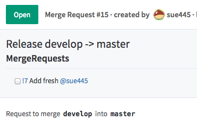

# GitlabMrRelease

Release MergeRequest generator for [GitLab](https://about.gitlab.com/)

[](https://badge.fury.io/rb/gitlab_mr_release)
[](https://travis-ci.org/sue445/gitlab_mr_release)
[](https://codeclimate.com/github/sue445/gitlab_mr_release)
[](https://coveralls.io/github/sue445/gitlab_mr_release?branch=master)
[](https://gemnasium.com/sue445/gitlab_mr_release)

This is inspired by the [git-pr-release](https://github.com/motemen/git-pr-release)

## Requirements

* Ruby v2.1+
* GitLab v7.11.0+

## Installation

```
$ gem install gitlab_mr_release
```

## Usage
### init

Copy setting files. And edit these files.

```sh
$ gitlab_mr_release init
      create  .env.gitlab
      create  gitlab_mr_release.md.erb
```

### create
```sh
$ gitlab_mr_release create --source=develop --target=master
MergeRequest is created

[Title] Release develop -> master

[Description]
# MergeRequests

* [ ] !7 Add fresh @sue445

[Url] http://example.com/your/project/merge_requests/15
```

description is accepted MergeRequests title between `--source` and `--target`



detail

```sh
$ gitlab_mr_release help create
Usage:
  gitlab_mr_release create -s, --source=SOURCE -t, --target=TARGET

Options:
  -s, --source=SOURCE  # Source branch (e.g. develop)
  -t, --target=TARGET  # Target branch (e.g. master)
      [--title=TITLE]  # MergeRequest title (default. 'Release :source -> :target')

Create merge requrst
```

## ProTip
### .env.gitlab
Environment variables read from `~/.env.gitlab` and current `.env.gitlab`

`~/.env.gitlab` 

```
GITLAB_API_ENDPOINT=http://example.com/api/v3
GITLAB_API_PRIVATE_TOKEN=XXXXXXXXXXXXXXXXXXX
TEMPLATE_FILE=gitlab_mr_release.md.erb
```

current `.env.gitlab`

```
GITLAB_PROJECT_NAME=group/name
TEMPLATE_FILE=gitlab_mr_release.md.erb
```

If defined both `~/.env.gitlab` and current `.env.gitlab`, current `.env.gitlab` is priority

### variables in template
```markdown
# MergeRequests
<% merge_requests.each do |mr| %>
* [ ] !<%= mr.iid %> <%= mr.title %> @<%= mr.author.username %>
<% end %>
```

`merge_requests` is array of [MergeRequest](https://github.com/gitlabhq/gitlabhq/blob/master/doc/api/merge_requests.md#get-single-mr)

## Development

After checking out the repo, run `bin/setup` to install dependencies. Then, run `rake spec` to run the tests. You can also run `bin/console` for an interactive prompt that will allow you to experiment. Run `bundle exec gitlab_mr_release` to use the gem in this directory, ignoring other installed copies of this gem.

To install this gem onto your local machine, run `bundle exec rake install`. To release a new version, update the version number in `version.rb`, and then run `bundle exec rake release`, which will create a git tag for the version, push git commits and tags, and push the `.gem` file to [rubygems.org](https://rubygems.org).

## Contributing

Bug reports and pull requests are welcome on GitHub at https://github.com/sue445/gitlab_mr_release.


## License

The gem is available as open source under the terms of the [MIT License](http://opensource.org/licenses/MIT).

